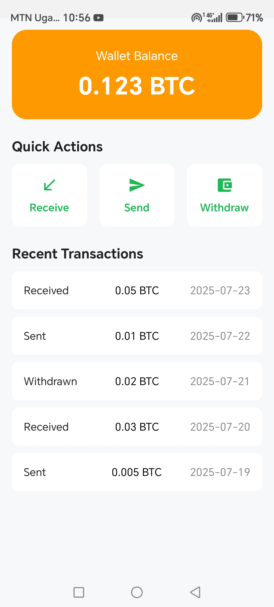
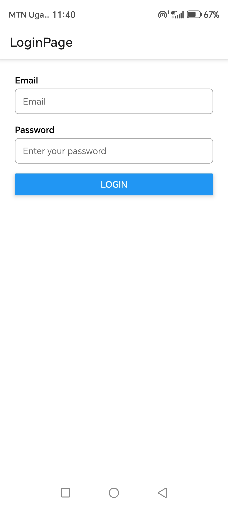
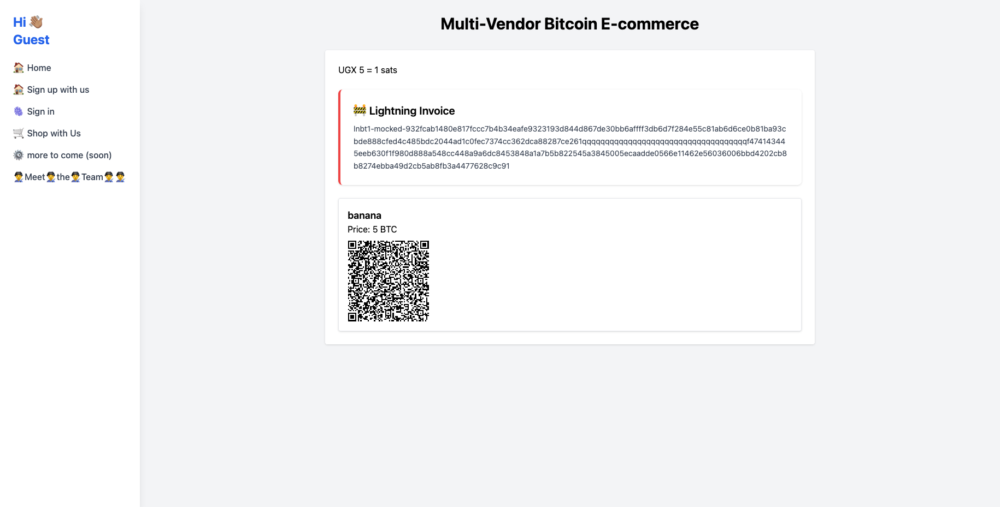

# 🔗 BTC Relay App

**BTC Relay App** is an all-in-one web + mobile solution developed for the Bitnob hackathon. It enables vendors to receive Bitcoin over the Lightning Network and instantly convert it to Uganda Shillings (UGX) via Bitnob's API. Shoppers pay using Lightning; vendors get local currency.

---

## 🧭 Table of Contents
1. [About](#about)
2. [Features](#features)
3. [Tech Stack](#tech-stack)
4. [Getting Started](#getting-started)
    - [Prerequisites](#prerequisites)
    - [Installation](#installation)
5. [Usage](#usage)
    - [Web Platform (Vendor & Shop)](#web-platform-vendor--shop)
    - [Vendor Mobile App](#vendor-mobile-app)
6. [Contributing](#contributing)
7. [License](#license)

---

## 📌 About

BTC Relay App allows:
- **Vendors**: Register online, list their projects/products, and generate Lightning invoices.
- **Customers**: Pay instantly via Bitcoin Lightning.
- **Vendors (Mobile App)**: Automatically convert received BTC to UGX using the Bitnob API and track payments in real-time.

Built for seamless and instant Bitcoin payments in Uganda’s local currency ecosystem!

---

## ✨ Features

- 👥 Vendor and User registration
- 📄 Vendor dashboards: add/update projects/products
- ⚡ Lightning invoice generation & payment processing
- 💱 Automatic BTC → UGX conversion via Bitnob API
- 📱 Mobile app for vendors: manage incoming payments and withdrawals
- 🖥️ Web UI for users/customers

---

## 🖼️ Screenshots & Concept

Here’s a glimpse of our workflow and design thinking:








## 🧩 Tech Stack

### 🌐 Site Part
- Tailwind CSS
- PHP
- MySQL 9.01 (database)

### 📱 App Part
- React Native
- Expo

---

## 🚀 How to Run the App

```bash
npm install
npm start
```


🧼 If You Are on a Fresh OS Environment

# Step 1: Download Node.js for your OS from https://nodejs.org
# Step 2: Install Expo CLI globally
npm install -g expo-cli

# Step 3: Clone our repository
git clone https://github.com/Joie199/btcrelayapp.git

# Step 4: Navigate into the app directory
cd btcrelayapp/app

# Step 5: Install dependencies
npm install

# Step 6: Start the development server
npm start

🌍 How to Run the Website

    Go to the site folder.

    Open it in your local PHP server environment (e.g., XAMPP, MAMP, or using php -S).

    Make sure to:

        Change the username and password for the database connection.

happy coding , and all the best
        Use your own Bitnob API key in the config file.


## 🤝 Contributing

Thanks to all the contributors who helped build BTC Relay App!

### Team Members / Contributors

- [@Yohannes Amanuel](https://github.com/Joie199)
- [@Samir Ibrahim](https://github.com/samiromer2)
- [@Emmanuel Ojok](https://github.com/ojokne)
<!-- Add more GitHub usernames here -->

Feel free to open issues, submit PRs, or suggest improvements!

---

## 🪪 License

This project is licensed under the **MIT License** — you’re free to use, modify, and share it with proper attribution.

See the full license in [`LICENSE`](./LICENSE).
